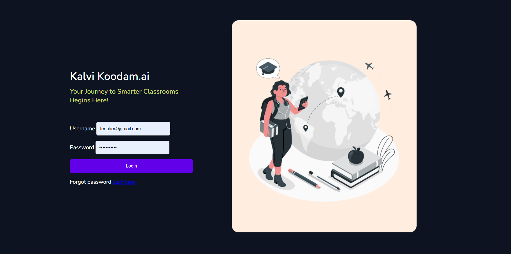
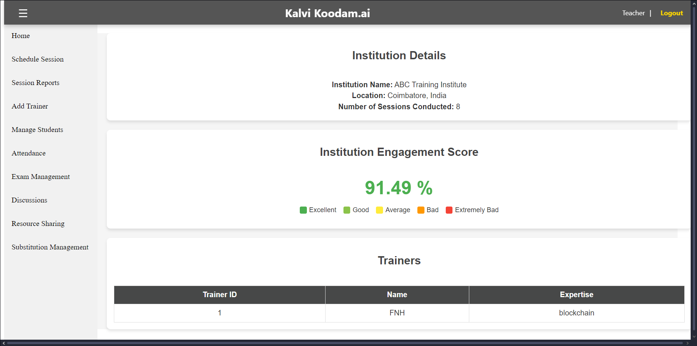
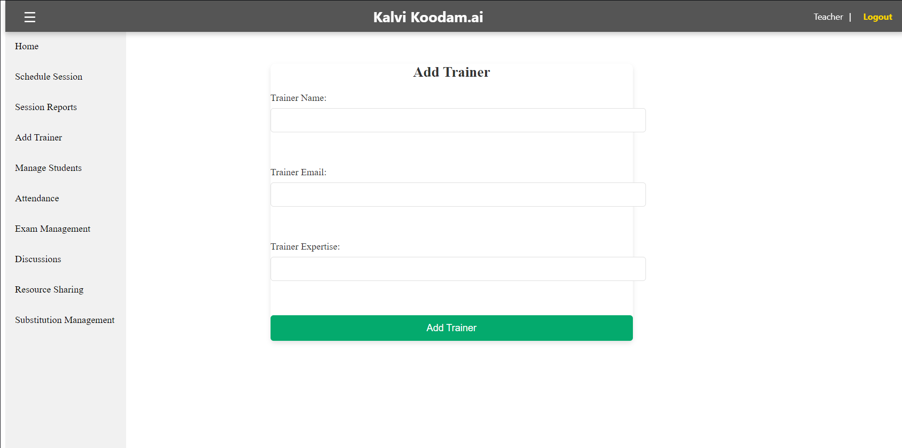
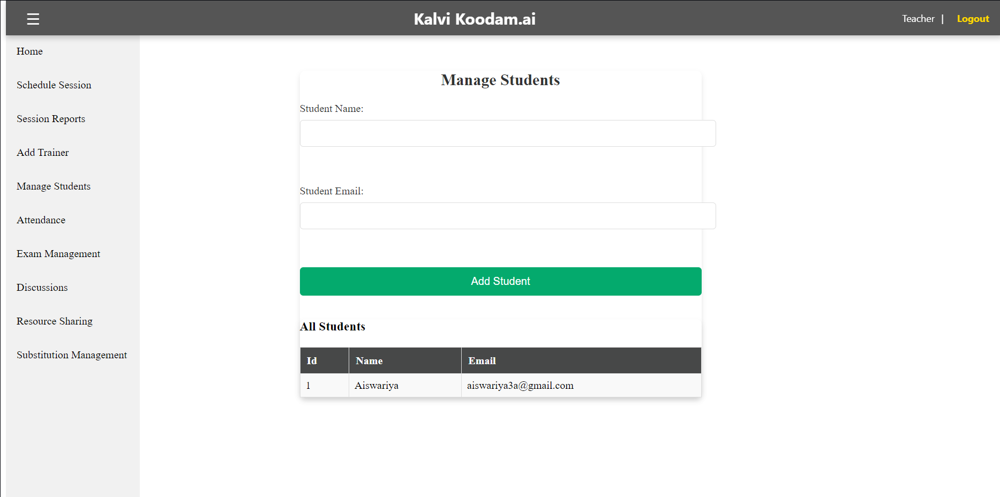
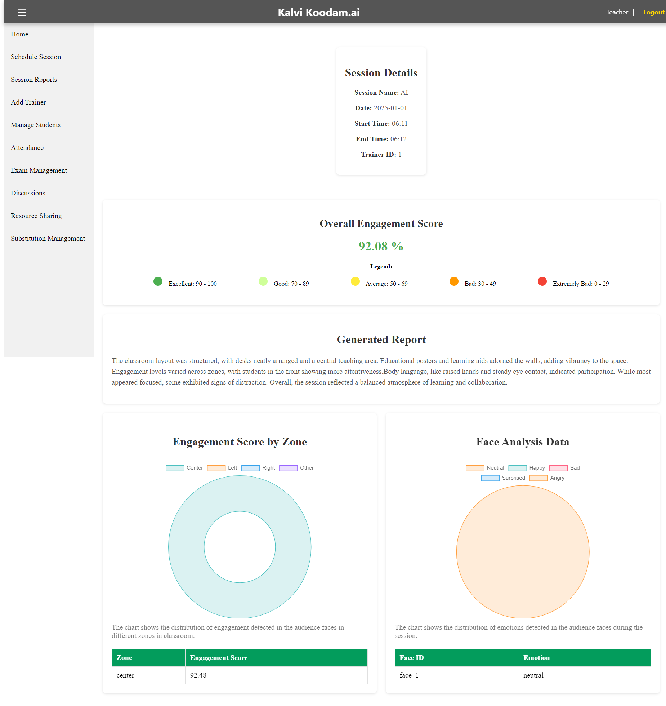

# Classroom Monitoring System

## Overview
**CMS** is a real-time system that tracks student engagement in classrooms using facial expressions and head movements. 
It provides trainers and institutions with feedback on attention levels and generates reports.
This system helps regulatory bodies monitor and improve educational sessions effectively.

This project leverages libraries like OpenCV, NumPy, and Pandas for processing images, analyzing emotions, and generating detailed reports. 

---

## Features
- Combines facial expression recognition and head pose estimation to calculate an engagement score that accurately reflects students' attention levels and emotional states in real time.
- Provides immediate feedback to institutions through an intuitive interface, enabling dynamic adjustment of teaching methods based on student engagement and focus levels during the session.

---

## Technical Stack
- **Face Detection**: ResNet50
- **Facial Expression Analysis**: VGG16-Face
- **Pose Estimation**: PnP Head Pose Estimation
- **LLM Integration**: NVIDIA Neva
- **Framework**: Flask
- **Database**: SQLite

---

## Getting Started
Follow these steps to clone and run the application locally.

### Prerequisites
- Python 3.9 or above
- Git

---

### Installation Steps

#### 1. Clone the Repository
```bash
git clone <repository_url>
cd <repository_name>
```

#### 2. Create a Virtual Environment
```bash
python -m venv venv
```

#### 3. Activate the Virtual Environment
- **Windows**:
  ```bash
  venv\Scripts\activate
  ```
- **macOS/Linux**:
  ```bash
  source venv/bin/activate
  ```

#### 4. Install Dependencies
```bash
pip install -r requirements.txt
```

---

### Getting NVIDIA NEVA API Key

#### Step 1: Visit the NVIDIA NEVA API Page
1. Go to [NVIDIA NEVA API](https://build.nvidia.com/nvidia/neva-22b).

#### Step 2: Create an NVIDIA Account
1. Click on **Sign Up** or **Log In** if you already have an account.
2. Use your **student ID** during registration to receive 5,000 free credits.

#### Step 3: Generate Your API Key
1. Click on the **Build with this NIM** button.
2. Follow the prompts to generate your API key.
3. Copy the generated API key. Keep it secure and do not share it publicly.

#### Step 4: Create a `.env` File
1. Open your project directory.
2. Create a new file named `.env`.
3. Add your API key to the file in the following format:

   ```env
   NVIDIA_API_KEY=your_generated_api_key_here
   ```

4. Replace `your_generated_api_key_here` with the actual API key you copied earlier.

---

### Start the Application
Run the following command to start the application:
```bash
python app.py
```

---

## UI Overview

### 1. Login Page
The login page allows institutions to access the CMS application securely.



---

### 2. Home Page
The home page displays an overview of institution data, including engagement scores, accessibility ratings, and session metrics.



---

### 3. Add Trainers
The "Add Trainers" page enables institutions to manage their trainers by adding new profiles and updating existing ones.



---

### 4. Manage Students
The "Manage Students" page allows institutions to handle student details, including enrollment and performance data.



---

### 5. Session Reports View
The "Session Reports" page provides an interface to view reports for each classroom session, summarizing engagement levels and other analytics.


---

### 6. Session Report Generated
This page displays a detailed report generated for a specific session, highlighting key metrics and insights.



---

## Contributing
If you wish to contribute to this project, feel free to submit a pull request or open an issue for discussion.